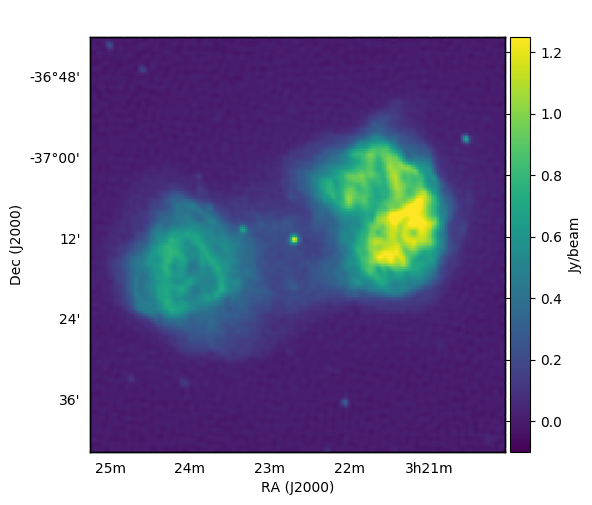
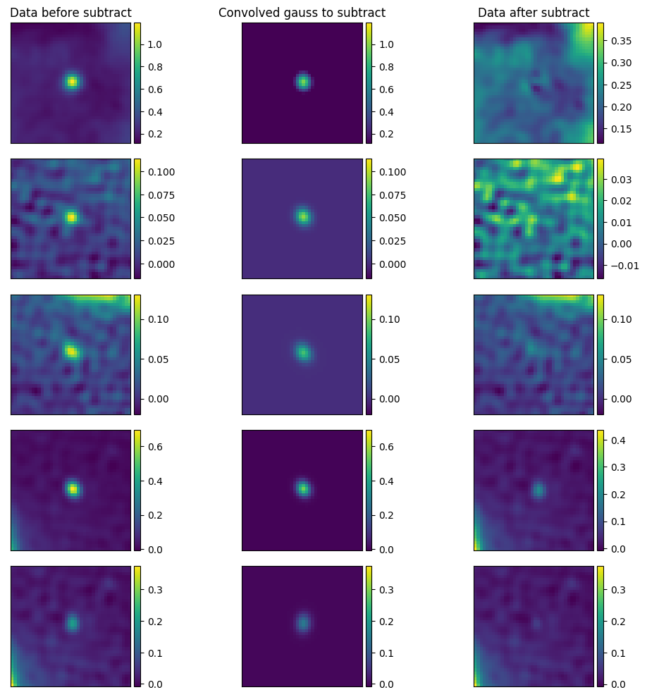
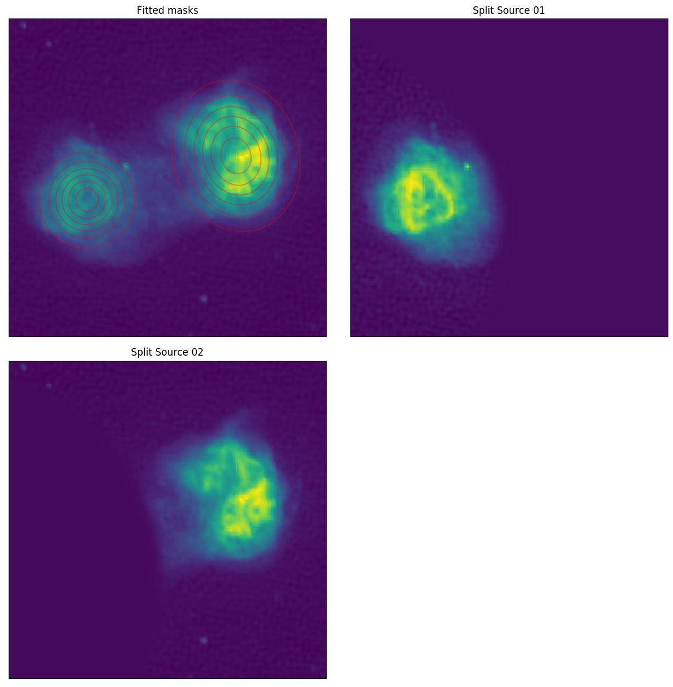
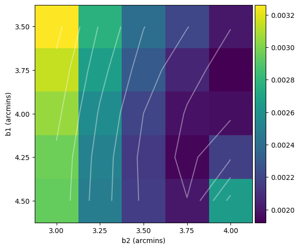
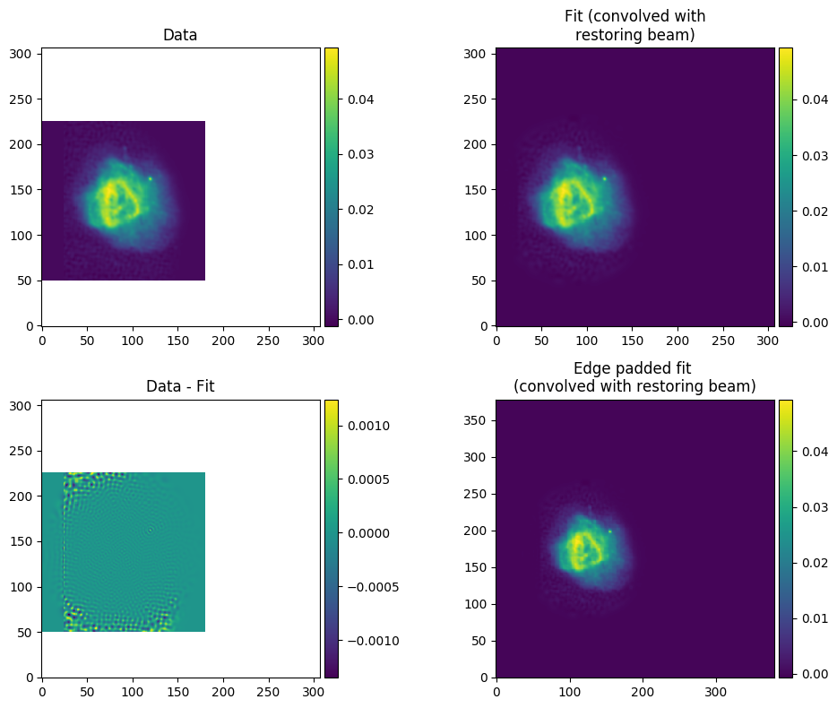

################
Tutorial
################

We will use fitting Fornax A (as detailed in Line et al. 2020) as an example. First of all, we need a FITS file. Most FITS files should work, but SHAMFI has been tested against FITS files out of WSClean. Fornax A is a complicated source and so requires some manipulation before fitting; if you are fitting something with less structure, you can probably skip the first two steps.

Our FITS file is called ``cropped_FornaxA_real_phase1+2.fits`` (which you can find in the ``tutorial_files`` directory of the SHAMFI repo), was made by multi-scale CLEANing MWA data, and looks like this:

Step 1: Remove compact sources (optional but a good idea)
############################################################
The more compact emission in a source, the more high-order basis functions are required to accurately fit the source. Point-like sources that are towards the edges are particularly problematic. To remove them we run ``subtract_gauss_from_image_shamfi.py`` with the following arguments:

.. code-block:: bash

   subtract_gauss_from_image_shamfi.py \
      --fits_file=cropped_FornaxA_real_phase1+2.fits \
      --gauss_table=gaussians_to_subtract.txt \
      --outname=gauss-subtracted_phase1+2_real_data.fits

Unfortunately we have to manually create ``gaussians_to_subtract.txt``, which requires the following columns: ``x_cent(pixels) y_cent(pixels) major(FWHM, arcmins) minor(FWHM, arcmins) pa(deg) int_flux(Jy)``. I have placed a copy in the ``tutorial_files`` directory, where ``gaussians_to_subtract.txt`` looks like:

.. code-block:: bash

   ## x_cent(pixels) y_cent(pixels) major(FWHM, arcmins) minor(FWHM, arcmins) pa(deg) int_flux(Jy)
   126 130.8 0.6 0.4 -30.0 1.3
   25 45 0.5 0.5 30.0 0.12
   58 42 0.7 0.5 40.0 0.123
   232 193 0.2 0.2 0.0 0.55
   233 192.5 0.8 0.2 -20.0 0.2

Running the ``subtract_gauss_from_image_shamfi.py`` command above will produce:

- ``gauss-subtracted_phase1+2_real_data.png``
- ``gauss-subtracted_phase1+2_real_data.fits``
- ``srclist_gaussian-rts.txt``
- ``srclist_gaussian-woden.txt``

You can use ``gauss-subtracted_phase1+2_real_data.png``, which you can use to tune your parameter estimates for the gaussians. I typically use ``kvis`` to estimate the x_cent and y_cent pixel locations, and then tune the PA, major, and minor using the output plot, which shows the sources you are trying to subtract before and after subtraction:

It says 'convolved gauss to subtract' as ``subtract_gauss_from_image_shamfi.py`` convolves the requested gaussian parameters with the restoring beam used to create the CLEANed image. Once you've fiddled the parameters to your liking, you can see what you've done by inspecting ``gauss-subtracted_phase1+2_real_data.fits``:

Step 2: Split the galaxy in twain
############################################################
As detailed in Line et al. 2020, the *x,y=0,0* pixel centre of the shapelet basis function greatly effects the quality of the fit. As the lobes of Fornax A are individually complicated, life is easier if we fit each lobe separately. We do that with the following command:

.. code-block:: bash

   mask_fits_shamfi.py \
      --fits_file=gauss-subtracted_phase1+2_real_data.fits \
      --output_tag=real_ForA_phase1+2 \
      --box=6,120,50,170 --box=117,246,75,218

The ``--box`` command outlines two areas in pixel coords (*xmin, xmax, ymin, ymax*) to fit an overall gaussian mask within, to split the image by weighting by the fitted gaussians. Running this command will produce:

- ``real_ForA_phase1+2_masked.png``
- ``real_ForA_phase1+2_split01.fits``
- ``real_ForA_phase1+2_split02.fits``

We can see the result by inspecting ``real_ForA_phase1+2_masked.png``:

Ok! Now we've pulled the image to pieces we can finally start modelling it.

Step 3: Fit the lobes
############################################################
First up, let's look at the commands, and then I'll break them down.

.. code-block:: bash

   fit_shamfi.py \
       --save_tag=real_ForA_phase1+2_lobe1 \
       --fits_file=real_ForA_phase1+2_split01.fits \
       --b1s=3.5,4.5 --b2s=3.0,4.0 --nmax=86 \
       --num_beta_values=5 \
       --edge_pad=25 \
       --fit_box=0,180,50,225 \
       --woden_srclist --plot_resid_grid --plot_edge_pad

   fit_shamfi.py \
       --save_tag=real_ForA_phase1+2_lobe2 \
       --fits_file=real_ForA_phase1+2_split02.fits \
       --b1s=3.5,4.5 --b2s=3.0,4.0 --nmax=86 \
       --num_beta_values=5 \
       --fit_box=100,290,85,260 \
       --edge_pad=25 \
       --woden_srclist --plot_resid_grid --plot_edge_pad

Running the first command will produce:

- ``grid-fit_matrix_real_ForA_phase1+2_lobe1.png``
- ``shamfi_real_ForA_phase1+2_lobe1_nmax86_fit.fits``
- ``shamfi_real_ForA_phase1+2_lobe1_nmax86_p100_fit.png``
- ``srclist-woden_real_ForA_phase1+2_lobe1_nmax086_p100.txt``

Similarly the second command will produce equivalent outputs for 'lobe2'. Here are some arguments and explanations of how I've arrived at these values. First off we need a couple equations to set some arguments:

:math:`n_{\mathrm{max}} \approx \dfrac{\vartheta_{\mathrm{max}}}{\vartheta_{\mathrm{min}}} - 1`

:math:`\beta \approx (\vartheta_{\mathrm{min}}\vartheta_{\mathrm{max}})^{\frac{1}{2}}`

where :math:`n_{\mathrm{max}}` is the maximum order of the basis functions to fit, :math:`\vartheta_{\mathrm{max}}` is the maximum scale of the image you are trying to model, and :math:`\vartheta_{\mathrm{min}}` is the minimum scale, and :math:`\beta` is a scaling factor for the basis functions. For this image, :math:`\vartheta_{\mathrm{max}} \sim 0.5^\circ`, and to set :math:`\vartheta_{\mathrm{min}}` I oversampled the angular resolution of the MWA in this image, by 3. Plugging those values in gives :math:`n_{\mathrm{max}}=86` and :math:`\beta \sim 3.2\,` arcmins, which give us starting points for the fitting process. Some other arguments and reasoning are below.

.. list-table::
   :widths: 38 62
   :header-rows: 1

   * - Argument
     - Values and Reasons
   * - ``--b1s=3.5,4.5``
     - The range over which to vary the :math:`\beta` scaling parameter for the major axis. Started with values around 3.2 as calculated above and changed the ranges based on fitting outcomes
   * - ``--num_beta_values=5``
     - SHAMFI does a grid search over all :math:`\beta` parameters - this means SHAMFI will fit 5 values for both :math:`\beta_1` and :math:`\beta_2`, for a total of 25 combinations
   * - ``--plot_edge_pad``
     - If the size of the basis functions exceed the area of the pixels being fitted, the model outside the desired area is unconstrained and you can get nonsense results. This option will plot an edge-padded image of the fitted image so you can check outside the area you fitted
   * - ``--edge_pad=25``
     - If you find you are getting bad results, you can set this to edge pad the image with zero pixels to constrain the model outside the image
   * - ``--fit_box=100,290,85,260``
     - Fitting is expensive when you have a large :math:`n_{\mathrm{max}}` so you can tell SHAMFI to only fit a certain box of pixels (by specifying a box bounded by pixel number, as *xmin, xmax, ymin, ymax*). Note if you use the ``--edge_pad`` option here, you'll need to supply bounds with the extra pixels applied.

Once that's finished run, you can inspect the fitting residuals for each combination of :math:`\beta_1` and :math:`\beta_2` by looking at ``grid-fit_matrix_real_ForA_phase1+2_lobe1.png``, to see if you need to change your :math:`\beta` ranges:

And of course, check out your model fit by looking at ``shamfi_real_ForA_phase1+2_lobe1_nmax86_p100_fit.png``. Note that only the box specified by ``--fit_box`` is plotted for the data so you know what you asked to be fitted.

You now have two separate lobes and a number of gaussian models, so we need to stitch them together into a coherent single model.

Step 4: Combine the models
#####################################################
Simply add as many single source models with the ``--srclist`` argument, and combine them into a single model:

.. code-block:: bash

   combine_srclists_shamfi.py \
       --srclist=srclist-woden_real_ForA_phase1+2_lobe1_nmax086_p100.txt \
       --srclist=srclist-woden_real_ForA_phase1+2_lobe2_nmax086_p100.txt \
       --srclist=srclist_gaussian-woden.txt \
       --outname=srclist-woden_real_ForA_phase1+2_nmax086_p100.txt

That's it! You now have a model that you can plug into WODEN. If you want to plug the model into the RTS as well, you can use ``convert_srclists_shamfi.py`` to switch between formats (or run SHAMFI with ``--rts_srclist`` from the start).

.. code-block:: bash

   convert_srclists_shamfi.py \
       --srclist=srclist-woden_real_ForA_phase1+2_nmax086_p100.txt \
       --outname=srclist-rts_real_ForA_phase1+2_nmax086_p100.txt
